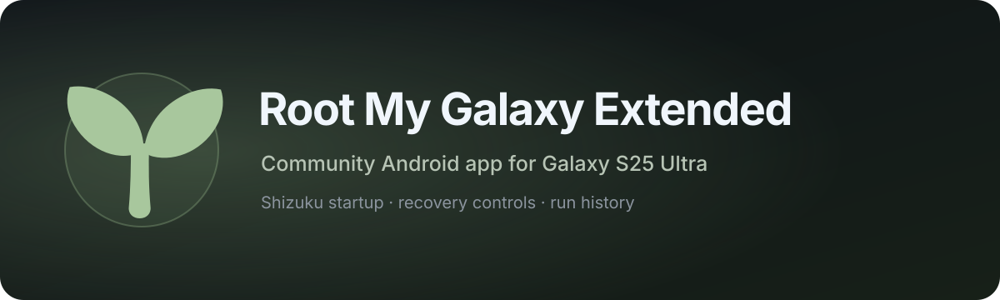

<p align="center">
  
</p>

<p align="center">
  <a href="https://github.com/igorcv88/Root-My-Galaxy-Extended/releases/latest"></a>
  <a href="https://github.com/igorcv88/Root-My-Galaxy-Extended/releases"></a>
  
  
  <a href="https://github.com/igorcv88/Root-My-Galaxy-Extended/actions/workflows/release.yml"></a>
  <a href="LICENSE"></a>
</p>

<p align="center">
  <strong>Temporary KernelSU root for maintained Samsung Galaxy S25 Ultra firmware without unlocking the bootloader or flashing a modified boot image.</strong>
</p>

<p align="center">
  <a href="https://github.com/igorcv88/Root-My-Galaxy-Payloads-Extended">Payloads</a>
  ·
  <a href="https://github.com/BuSung-dev/Root-My-Galaxy">Upstream app</a>
  ·
  <a href="https://github.com/igorcv88/Root-My-Galaxy-Extended/releases/latest">Latest release</a>
</p>

## Root My Galaxy Extended

This fork builds on [BuSung-dev's original Root My Galaxy](https://github.com/BuSung-dev/Root-My-Galaxy), combining the Samsung root app with maintained Galaxy S25 Ultra payloads and Samsung-specific KernelSU integration. It brings together upstream work, later contributions from other forks, and app-side automation and recovery features.

| Area | Included in this fork |
| --- | --- |
| Root modes | Auto Root, Manual Online, Manual Offline and a verified local cache |
| KernelSU | Samsung-specific 3.3.0 integration and separate firmware profiles |
| Shizuku | Optional startup at boot and after root, with local Wireless ADB support |
| Recovery | Restart Zygote, Reload KernelSU modules, KernelSU soft reboot, Reboot & unroot |
| Settings | Payload source, boot timing and optional post-root behavior |
| History | Manual and automatic runs, individual logs and bulk ZIP export |

The upstream reference here is the original BuSung project. These features include adapted contributions credited below; not every component originated in this fork. “Extended” does not expand device compatibility beyond the maintained profiles.

<p align="center">
  <a href="#maintained-s938b-profiles">Compatibility</a> ·
  <a href="#current-architecture">Architecture</a> ·
  <a href="#auto-root">Auto Root</a> ·
  <a href="#recovery-controls">Recovery</a> ·
  <a href="#credits-and-provenance">Credits</a>
</p>

> [!WARNING]
> This software uses a kernel exploit. A failed run can panic or reboot the device. Use it only on a device you own or are explicitly authorized to test.

## Maintained S938B profiles

| Profile | Android | Kernel | Status |
| --- | --- | --- | --- |
| `pa3q-S938BXXSBCZG3` | Android 16 / API 36 | `6.6.98-android15-8-pd6ff1cd-abogkiS938BXXSBCZG3-4k` | Legacy maintained profile |
| `pa3q-S938BXXUCZZI4` | Android 17 / API 37 | `6.6.127-android15-8-p33f4ffe-abogkiS938BXXUCZZI4-4k` | Current One UI 9 beta profile; exploit + KernelSU hardware validated |

ZZI4 exact build identity is `CP2A.260605.016.S938BXXUCZZI4`, SPL `2026-08-05`, ABI `arm64-v8a`, 4K pages. Firmware or kernel updates can invalidate offsets, Tracefs behavior or the exact KernelSU module pair.

## Current architecture

The app now keeps exploit acquisition, KernelSU restoration and post-root userspace automation as separate layers:

```text
Manual Online / Manual Offline / Auto Root
                  ↓
       exact target profile + routePolicy
                  ↓
       CVE-2026-43499 target payload
                  ↓
          bootstrap UID 0
                  ↓
 target root helper auto-late-loads KernelSU
                  ↓
 KernelSU control + PID1 mount readiness
                  ↓
     successful root is checkpointed
                  ↓
 optional Shizuku / native soft reboot
```

The app never makes Wireless ADB or Shizuku a dependency of root acquisition. Auto Root remains Offline + Standalone and uses only the last-known-good payload set.

## ZZI4 exploit route

ZZI4 uses one feed-defined `routePolicy` shared by Manual and Auto Root. Current policy is:

```text
slideRoute=auto
attempts=24
attemptTimeoutSec=120
p0AttemptTimeoutSec=45
p0OffsetCache=true
prefersShellTransport=true
```

When shell/Tracefs access is available, the payload derives the KASLR slide from Tracefs. On this firmware the slide and data-addressing modes are intentionally separated: even when Tracefs supplies the slide, kernel data writes use the physical-load alias rather than the canonical direct map.

The ZZI4 application payload therefore enables:

- `APP_TRACEFS_SLIDE=1`;
- `APP_TRACEFS_PHYS_ALIAS_DATA=1`;
- `APP_PHYS_P0_ORACLE=1` as explicit fallback/oracle support;
- a bounded `APP_FOPS_RETRY_BUDGET=8`;
- shared FOPS retry state so a landed write terminates further shots;
- delay rotation across retry shots rather than repeating one stale delay.

The first hardware validation of the current physical-alias build completed in supervisor attempt 1 with Tracefs KASLR, `window=1`, a successful physical write and a complete KernelSU handoff. The more invasive sync-pselect synchronization experiment remains intentionally parked and is not part of the production path.

## CZG3 compatibility

CZG3 remains supported as a separate exact profile. It retains its own offsets, route defaults and KernelSU artifact. Target policy is data, not app hardcoding, so adding or changing one firmware profile does not silently alter another.

Manual keeps its historical diagnostic/minimum-uptime control; Auto Root has its own independent total-uptime floor. The two preferences are intentionally not coupled.

## Payload integrity and offline cache

Manual Online resolves `support/targets-v3.json`, downloads the exact target artifacts, verifies size and SHA-256, and verifies that the APK-bundled root helper matches the target feed.

Only after exploit success and KernelSU global readiness does the app publish that exact set as the last-known-good offline cache. Cache identity includes exploit, KernelSU, root helper and route policy, so a feed-only policy change can refresh the cache even when binary hashes stay identical.

Manual Offline and Auto Root never fall back to hidden network downloads.

## KernelSU late-load on Samsung

The S938B KernelSU path is a Samsung-specific KernelSU 3.3.0 forward port with KDP/RKP/DEFEX handling and no unsafe generic live-text patching.

ZZI4 additionally uses the staged-daemon hotfix required by the beta firmware. The important invariants are:

- the verified `ksud` is pre-staged before KernelSU changes the execution security state;
- late-load serializes callers through an abstract AF_UNIX lock rather than a pre-KernelSU filesystem lock;
- the loader switches into PID1's mount namespace before owning systemless/module mounts;
- `/data/adb/ksud` is installed by the late-load path, not by post-root automation;
- a boot-scoped global-readiness marker is published only after blocking mount stages complete;
- duplicate late-load callers in the same kernel boot do not replay module stages.

Post-root code must not restage `.ksud-stage`, replace `/data/adb/ksud` or call `late-load` again. Tests enforce those boundaries.

## Native KernelSU soft reboot

`Soft reboot after root` is deliberately post-root. Once KernelSU has been verified, Root My Galaxy launches one detached boot-scoped keeper through an already-working root bridge.

The keeper does **not** restart zygote directly and does **not** gate the restart on Meta-Overlayfsx or ViPER mounts. Those mounts are part of the userspace lifecycle the restart itself must recreate.

Instead, the keeper consumes the already-installed KernelSU userspace binary and requests:

```text
/data/adb/ksud soft-reboot
```

KernelSU then owns the native userspace transition: reset `sys.boot_completed`, `stop`, run post-fs-data/metamodule/mount lifecycle, `start`, run services, wait for framework boot completion, then run boot-completed stages.

This preserves the firmware-sensitive late-load/daemon handoff and avoids the previous failure where the keeper waited for an OverlayFSx mount before initiating the very restart that would create it.

Keeper log: `/data/local/tmp/rmg-postroot-keeper.log`.

Accepted-request marker: `/data/local/tmp/.rmg-soft-reboot-accepted`.

The marker is keyed to kernel `boot_id`; a userspace reboot keeps the same kernel boot and therefore cannot accidentally trigger Auto Root or a second soft reboot for that same boot.

## Shizuku after root and after soft reboot

Shizuku is Binder-first and root-first after KernelSU exists.

Immediately after successful root, the post-root flow prefers an existing Shizuku Binder, then an authenticated root bridge, and only uses local Wireless ADB as compatibility fallback.

After a KernelSU soft reboot, framework `BOOT_COMPLETED` may be emitted again while the kernel and KernelSU remain active. The Shizuku boot coordinator now recognizes that case before waiting for Wi-Fi:

1. probe the existing Binder;
2. if KernelSU is already active, try the RMG root-helper bridge;
3. if needed, try an already-authorized direct KernelSU `su` bridge;
4. launch Shizuku's native starter through root;
5. only if no non-interactive root bridge works, continue to the existing Wi-Fi/mDNS/Wireless-ADB fallback.

A soft reboot therefore does not need to repeat the long Wireless ADB bootstrap when root permission is already available.

## Auto Root

Auto Root runs at most once per full kernel boot and is intentionally conservative around the exploit boundary:

```text
BOOT_COMPLETED
      ↓
boot_id duplicate gate
      ↓
foreground uptime gate
      ↓
fresh :autoroot_exec process
      ↓
last-known-good Offline + Standalone payload
      ↓
KernelSU auto-late-load / serialized fallback
      ↓
global readiness verification
      ↓
History success checkpoint
      ↓
optional post-root automation
```

A soft/userspace reboot does not change `/proc/sys/kernel/random/boot_id`, so duplicate framework boot events are consumed without launching another exploit.

## Recovery controls

Settings includes four recovery controls, all requiring active KernelSU:

| Control | Effect |
| --- | --- |
| Restart Zygote | Restarts Android framework processes without rebooting the kernel |
| Reload KernelSU modules | Reapplies module stages using the installed KernelSU |
| KernelSU soft reboot | Restarts Android userspace and its module lifecycle |
| Reboot & unroot | Disables Auto Root, then performs a full reboot to clear temporary root |

These controls interrupt apps or module state; they are not an unbrick tool. Rebooting clears the temporary root session, but does not undo every change made by root apps or modules.

## History and diagnostics

History stores manual and automatic runs, target profile, terminal result and runtime logs. The exploit path avoids continuous persistence inside the sensitive race window; terminal state is written after the root path is complete.

Individual logs can be exported as plain `.log`; completed runs can be exported in bulk as ZIP archives.

For post-root soft-reboot diagnosis, inspect:

```sh
su -c 'cat /data/local/tmp/rmg-postroot-keeper.log'
```

## Building and releases

The release workflow runs unit tests, Android lint and release assembly, verifies the bundled root helper against the commit-pinned payload feed, signs the APK and publishes the release artifacts.

Payload publication is maintained in the companion repository. Its workflow is target-aware, pins one source commit for all matrix builds, and aborts publication if `main` advances between plan/build/publish phases.

## Credits and provenance

This fork includes work derived or adapted from the projects and contributors below.

- **[BuSung-dev/Root-My-Galaxy](https://github.com/BuSung-dev/Root-My-Galaxy)** — upstream application architecture, UI and original project.
- **[BuSung-dev/Root-My-Galaxy-Payloads](https://github.com/BuSung-dev/Root-My-Galaxy-Payloads)** — upstream payload/feed architecture and Samsung exploit integration.
- **[mitschud](https://github.com/mitschud)** / **[BuSung payload PR #300](https://github.com/BuSung-dev/Root-My-Galaxy-Payloads/pull/300)** — Galaxy S25 6.6.127 Tracefs route, root-helper auto-late-load design and later writer-timing reference used by the ZZI4 port.
- **[NebuSec/CyberMeowfia](https://github.com/NebuSec/CyberMeowfia/tree/main/IonStack/CVE-2026-43499/exploit)** — published CVE-2026-43499 exploit lineage.
- **[KernelSU](https://github.com/tiann/KernelSU)** — kernel root framework and native `ksud` lifecycle/soft reboot.
- **[HyperRamzey/Root-My-Galaxy](https://github.com/HyperRamzey/Root-My-Galaxy)** — reference for persistent local ADB/Shizuku post-root automation and single-owner/boot-scoped coordination.
- **[igorcv88/Meta-Overlayfsx-ViPER-safe](https://github.com/igorcv88/Meta-Overlayfsx-ViPER-safe)**, based on **[RipperHybrid/meta-overlayfsx](https://github.com/RipperHybrid/meta-overlayfsx)** — OverlayFSx metamodule and ViPER-safe granular mount architecture.
- **[Shizuku](https://github.com/RikkaApps/Shizuku)** and the user's **thedjchi/Shizuku** fork — Shizuku API/provider and root/ADB starter behavior.
- **Android Open Source Project / BoringSSL / Bouncy Castle** — Wireless ADB authentication/pairing implementation references and cryptographic provider.

Each upstream project remains subject to its own license and copyright notices. This repository is distributed under [LICENSE](LICENSE).
